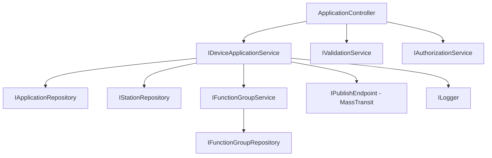

# ECO - GraphQL POC Implementation Plan

[[TOC]]

## Document Overview

**Related Documents:**
- [GraphQL Migration RUD](./GraphQL-Migration-RUD.md) - Design and analysis

**Purpose:** Provide actionable implementation plan for GraphQL POC in ECO Protection domain

**POC Objectives:**
1. ✅ **Feasibility**: Verify GraphQL can implement bulk create/delete operations
2. ✅ **Performance**: Measure REST vs GraphQL performance (target: >2x improvement)
3. ✅ **Coexistence**: Validate smooth migration with REST/GraphQL side-by-side
4. ✅ **Effort**: Track actual effort vs estimates

**Success Criteria:**
- [ ] Bulk create 20+ devices: **>2x faster than REST**
- [ ] Complex hierarchical query: **<100ms response time**
- [ ] **60% reduction** in API calls for typical workflows
- [ ] REST and GraphQL coexist without breaking changes
- [ ] Team completes POC in **≤3 weeks** (120 hours)

---

## Work Package Structure

### Feature: GraphQL POC - Bulk Operations

**Epic Link:** ECO Performance Improvements  
**Priority:** High  
**Target Sprint:** Sprint XX (Q1 2025)  
**Team:** Protection Domain Team  
**Effort Estimate:** 160 hours (4 weeks: 1 week analysis + 3 weeks implementation)

#### Work Package Hierarchy

```
Feature: GraphQL POC - Bulk Operations
├── US-000: Analysis & Documentation (Phase 0)
│   ├── Task-000: Finalize RUD document
│   ├── Task-001a: Analyze ApplicationController endpoints
│   ├── Task-001b: Document business logic for bulk operations
│   ├── Task-001c: Map DTOs and validation rules
│   ├── Task-001d: Identify service dependencies
│   └── Task-001e: Create endpoint migration matrix
│
├── US-001: Setup GraphQL Infrastructure
│   ├── Task-001: Install HotChocolate packages
│   ├── Task-002: Configure GraphQL endpoint
│   ├── Task-003: Setup Banana Cake Pop UI
│   └── Task-004: Configure authentication
│
├── US-002: Implement Bulk Create Mutation
│   ├── Task-005: Define CreateApplicationInput type
│   ├── Task-006: Implement CreateApplications resolver
│   ├── Task-007: Add nested FunctionGroup creation
│   ├── Task-008: Implement error handling
│   └── Task-009: Add DataLoader for FunctionGroups
│
├── US-003: Implement Bulk Delete Mutation
│   ├── Task-010: Define DeleteApplications mutation
│   ├── Task-011: Implement cascade delete logic
│   ├── Task-012: Add partial success handling
│   └── Task-013: Implement rollback mechanism
│
├── US-004: Implement Hierarchical Query
│   ├── Task-014: Define Station query type
│   ├── Task-015: Implement nested Application resolver
│   ├── Task-016: Add DataLoader for Applications
│   ├── Task-017: Optimize N+1 queries
│   └── Task-018: Add filtering and pagination
│
├── US-005: Performance Testing & Comparison
│   ├── Task-019: Create REST baseline benchmarks
│   ├── Task-020: Create GraphQL benchmarks
│   ├── Task-021: Setup Application Insights metrics
│   ├── Task-022: Run bulk operation tests
│   └── Task-023: Generate performance report
│
├── US-006: Frontend Integration (Angular)
│   ├── Task-024: Install Apollo Client
│   ├── Task-025: Configure Apollo with auth
│   ├── Task-026: Generate TypeScript types
│   ├── Task-027: Implement bulk create UI
│   └── Task-028: Add error handling UI
│
└── US-007: Testing & Documentation
    ├── Task-029: Write integration tests (imperative YAML)
    ├── Task-030: Write unit tests for resolvers
    ├── Task-031: Create GraphQL usage documentation
    ├── Task-032: Update API documentation
    └── Task-033: Create POC demo video
```

---

## Phase 0: Analysis & Documentation (Detailed)

### US-000: Endpoint Analysis & RUD Finalization

**As a** backend developer  
**I want to** thoroughly analyze and document all REST endpoints before migration  
**So that** GraphQL implementation captures all business logic, validations, and dependencies

**Acceptance Criteria:**
- [ ] RUD document finalized with migration decisions for all 13 endpoints
- [ ] Each endpoint documented with: business logic, DTOs, validations, dependencies
- [ ] Endpoint migration matrix created showing priority, complexity, dependencies
- [ ] Service dependency graph created
- [ ] DTO mapping document created (REST ↔ GraphQL)
- [ ] Validation rules extracted and documented
- [ ] Team review completed and approved

**Effort:** 40 hours (1 week for 2 backend developers)  
**Priority:** Must Have (Blocks all other work)  
**Dependencies:** None  
**Testing:** Peer review and architecture review

---

### Phase 0 Tasks Breakdown

#### Task-000: Finalize RUD Document (4 hours)

**Goal:** Complete GraphQL-Migration-RUD.md with final decisions

**Deliverables:**
- [ ] Executive summary updated with Phase 0 findings
- [ ] All open questions resolved
- [ ] Stakeholder feedback incorporated
- [ ] Document marked as "Approved" status

**Assigned To:** Tech Lead

---

#### Task-001a: Analyze ApplicationController Endpoints (12 hours)

**Goal:** Document each of the 13 REST endpoints in detail

**Template for Each Endpoint:**

```markdown
### Endpoint: [HTTP Method] [Route]

**Purpose:** [What business problem does it solve?]

**Current Usage:**
- Frontend components: [List Angular components using this]
- Call frequency: [High/Medium/Low]
- Typical payload size: [KB]

**Request Model:**
```csharp
// Exact DTO with annotations
public class CreateApplicationDto
{
    [Required]
    public string StationName { get; set; }
    // ... all properties
}
```

**Response Model:**
```csharp
// Exact response DTO
```

**Business Logic:**
1. [Step-by-step what the endpoint does]
2. [Include validation steps]
3. [Include authorization checks]
4. [Include database operations]

**Service Dependencies:**
- `IDeviceApplicationService.MethodName()`
- `IValidationService.MethodName()`
- [List all injected services and methods called]

**Validation Rules:**
- Field: `StationName` - Required, max 100 chars, valid station must exist
- Field: `PublicTechnicalName` - Required, unique, format: alphanumeric
- [Document ALL validation rules]

**Database Operations:**
- Read: `SELECT * FROM Stations WHERE Name = @stationName`
- Write: `INSERT INTO Applications (...) VALUES (...)`
- [List all SQL operations]

**Error Scenarios:**
- Station not found → 404 NotFound
- Duplicate PTN → 409 Conflict
- [List all error cases and HTTP status codes]

**Performance Characteristics:**
- Average latency: [ms]
- Database queries: [count]
- N+1 issues: [Yes/No - describe]

**GraphQL Migration:**
- Target: Mutation/Query
- Priority: High/Medium/Low
- Complexity: Simple/Medium/Complex
- Notes: [Any special considerations]
```

**Example Analysis: CreateApplicationsAsync**

```markdown
### Endpoint: POST /api/v1/protection/{stationName}/applications

**Purpose:** Create one or more device applications in a station

**Current Usage:**
- Frontend components: 
  - `device-creation-wizard.component.ts`
  - `bulk-device-import.component.ts`
- Call frequency: High (user creates 1-20 devices per operation)
- Typical payload size: 2-5 KB for single device, 10-50 KB for bulk

**Request Model:**
```csharp
public class CreateDeviceApplicationDto
{
    [Required(ErrorMessage = "Station name is required")]
    [MaxLength(100)]
    public string StationName { get; set; }

    [Required(ErrorMessage = "PTN is required")]
    [MaxLength(200)]
    [RegularExpression(@"^[A-Za-z0-9_\-\.]+$")]
    public string PublicTechnicalName { get; set; }

    [Required]
    [MaxLength(50)]
    public string OrderNumber { get; set; }

    [MaxLength(200)]
    public string? DeviceName { get; set; }

    public string? ParentPtnPath { get; set; }
}
```

**Response Model:**
```csharp
public class ApiResponse<DeviceApplication>
{
    public List<DeviceApplication> Data { get; set; }
    public List<ErrorDetail> Errors { get; set; }
}

public class DeviceApplication
{
    public string PublicTechnicalName { get; set; }
    public string DeviceName { get; set; }
    public string StationName { get; set; }
    public string OrderNumber { get; set; }
    public string ParentPtnPath { get; set; }
    public DateTime CreatedAt { get; set; }
    public string CreatedBy { get; set; }
    // ... 12 more properties
}
```

**Business Logic:**
1. Validate JWT token and extract user identity
2. Validate `StationName` exists in database
3. For each device in request array:
   a. Validate PTN is unique within station
   b. Validate `OrderNumber` matches Siemens catalog
   c. If `ParentPtnPath` not provided, default to `{StationName}`
   d. Validate parent path exists
   e. Check user has CREATE permission on station
   f. Insert device into `Applications` table
   g. Create default function groups based on OrderNumber
   h. Publish `DeviceCreated` event to MassTransit
   i. Log operation to Application Insights
4. Return list of created devices + any errors (partial success supported)

**Service Dependencies:**
- `IDeviceApplicationService.CreateApplicationsAsync(dtos, cancellationToken)`
  - Calls `IStationRepository.GetByNameAsync(stationName)`
  - Calls `IApplicationRepository.ExistsAsync(ptn)`
  - Calls `IApplicationRepository.InsertAsync(application)`
  - Calls `IFunctionGroupService.CreateDefaultGroupsAsync(device)`
- `IValidationService.ValidateStationName(stationName)`
- `IValidationService.ValidateCreateApplications(dtos)`
- `IAuthorizationService.CheckPermissionAsync(user, "CREATE", stationName)`
- `IPublishEndpoint.Publish(new DeviceCreatedEvent(...))`

**Validation Rules:**
- `StationName`: Required, MaxLength 100, must exist in DB, user must have access
- `PublicTechnicalName`: Required, MaxLength 200, alphanumeric + `_-.`, unique within station
- `OrderNumber`: Required, MaxLength 50, must match Siemens catalog (7SX format)
- `DeviceName`: Optional, MaxLength 200
- `ParentPtnPath`: Optional, if provided must exist, defaults to `{StationName}`
- **Business Rule:** Max 100 devices per bulk create operation
- **Business Rule:** User must have "Device.Create" permission on station

**Database Operations:**
- Read: `SELECT Id FROM Stations WHERE Name = @stationName` (1 query)
- Read: `SELECT COUNT(*) FROM Applications WHERE PublicTechnicalName = @ptn` (N queries - N+1 issue!)
- Read: `SELECT * FROM SiemensCatalog WHERE OrderNumber = @orderNumber` (N queries)
- Write: `INSERT INTO Applications (...) VALUES (...)` (N queries - not batched!)
- Write: `INSERT INTO FunctionGroups (...) VALUES (...)` (M queries for default groups)

**Error Scenarios:**
- Station not found → `404 NotFound` with message "Station '{name}' not found"
- Invalid PTN format → `400 BadRequest` with validation error
- Duplicate PTN → `409 Conflict` with message "Device '{ptn}' already exists"
- Order number not in catalog → `400 BadRequest` with message "Invalid order number"
- User lacks permission → `403 Forbidden`
- Parent path not found → `404 NotFound`
- Exceeds 100 device limit → `400 BadRequest` with message "Maximum 100 devices per request"

**Performance Characteristics:**
- Average latency: 250ms for single device, 3.5 seconds for 20 devices
- Database queries: 1 + (3N) + M queries (N+1 problem!)
- N+1 issues: **Yes** - checks PTN uniqueness individually for each device
- Bottleneck: Sequential database inserts (not batched)

**GraphQL Migration:**
- Target: **Mutation** `createApplications(input: [CreateApplicationInput!]!): ApplicationResponse`
- Priority: **High** (bulk operations are main POC focus)
- Complexity: **Medium** (straightforward mutation, but need to handle partial success)
- Notes: 
  - Opportunity to batch database operations (fix N+1)
  - Can eliminate sequential REST calls from frontend
  - Partial success handling critical
  - Event publishing must remain (MassTransit)
```

**Deliverables:**
- [ ] Analysis document for all 13 endpoints (use template above)
- [ ] Each endpoint documented in separate markdown file: `docs/endpoint-analysis/[endpoint-name].md`
- [ ] Example provided: `docs/endpoint-analysis/CreateApplicationsAsync.md`

**Assigned To:** Backend Dev 1 & Backend Dev 2 (split endpoints)

---

#### Task-001b: Document Business Logic for Bulk Operations (8 hours)

**Goal:** Deep dive into bulk operation workflows

**Focus Areas:**
1. **Bulk Create Workflow:**
   - Frontend user journey (wizard steps)
   - What triggers bulk create? (CSV import, manual form, template)
   - Transaction boundaries (all-or-nothing vs partial success)
   - Default function groups creation logic
   - Event publishing for downstream systems

2. **Bulk Delete Workflow:**
   - Cascade delete rules (function groups, functions, alarms)
   - Soft delete vs hard delete
   - History/audit trail requirements
   - Rollback scenarios

3. **Hierarchical Query Workflow:**
   - Station overview page data requirements
   - Which nested entities to fetch (function groups, functions, alarms, etc.)
   - Filtering/sorting requirements
   - Pagination needs

**Deliverables:**
- [ ] Workflow diagrams (draw.io or mermaid)
- [ ] Sequence diagrams for key operations
- [ ] Business rules document
- [ ] Edge case analysis

**Assigned To:** Backend Dev 1 + Product Owner (business rules validation)

---

#### Task-001c: Map DTOs and Validation Rules (8 hours)

**Goal:** Create comprehensive DTO mapping document

**DTO Mapping Matrix:**

| REST DTO | GraphQL Input/Type | Field Mappings | Validation Changes | Notes |
|----------|-------------------|----------------|-------------------|-------|
| `CreateDeviceApplicationDto` | `CreateApplicationInput` | `StationName` → `stationName` (camelCase)<br>`PublicTechnicalName` → `publicTechnicalName`<br>... | No changes, keep same rules | Add nested `functionGroups` field |
| `DeviceApplication` | `DeviceApplicationType` | All fields map 1:1 | N/A (output type) | Add resolver for `functionGroups` |
| `CreateFunctionGroupDto` | `CreateFunctionGroupInput` | ... | ... | ... |

**Validation Rules Extraction:**

```markdown
### Validation Rules Inventory

#### Station Name Validation
- **Location:** `ValidationService.ValidateStationName()`
- **Rules:**
  - Required: Yes
  - Max Length: 100 characters
  - Format: Alphanumeric + underscores
  - Database Check: Must exist in `Stations` table
  - Authorization: User must have access to station
- **Error Messages:**
  - Empty: "Station name is required"
  - Not found: "Station '{name}' not found"
  - No access: "You do not have permission to access station '{name}'"
- **GraphQL Usage:** Same validation in resolver, reuse existing service

#### Public Technical Name (PTN) Validation
- **Location:** `ValidationService.ValidatePTN()`
- **Rules:**
  - Required: Yes
  - Max Length: 200 characters
  - Format: `^[A-Za-z0-9_\-\.]+$` (alphanumeric + `_-.`)
  - Uniqueness: Must be unique within station
  - Path Format: Must form valid hierarchical path
- **Error Messages:**
  - Empty: "PTN is required"
  - Invalid format: "PTN contains invalid characters. Only alphanumeric, underscore, hyphen, and dot allowed"
  - Duplicate: "Device '{ptn}' already exists in station '{station}'"
- **GraphQL Usage:** Same validation, consider batching uniqueness checks

[... document all validation rules ...]
```

**Deliverables:**
- [ ] Complete DTO mapping matrix (Excel or Markdown table)
- [ ] Validation rules inventory (all fields, all endpoints)
- [ ] Custom validation logic documentation
- [ ] Proposed GraphQL validation strategy

**Assigned To:** Backend Dev 2

---

#### Task-001d: Identify Service Dependencies (4 hours)

**Goal:** Map all service layer dependencies for GraphQL resolvers

**Service Dependency Graph:**



**Service Interface Analysis:**

```markdown
### IDeviceApplicationService

**Purpose:** Business logic for device application CRUD

**Methods to Reuse in GraphQL:**

1. `CreateApplicationsAsync(CreateDeviceApplicationDto[] dtos, CancellationToken ct)`
   - **Current Usage:** REST POST endpoint
   - **GraphQL Usage:** Call from `createApplications` mutation resolver
   - **Changes Needed:** None - already supports batch
   - **Return Type:** `ApiResponse<DeviceApplication>`

2. `GetApplicationsFromStationAsync(string stationName, string? devicePtns, CancellationToken ct)`
   - **Current Usage:** REST GET endpoint
   - **GraphQL Usage:** Call from DataLoader for batching
   - **Changes Needed:** Modify to accept `string[]` instead of comma-separated string
   - **Return Type:** `ApiResponse<DeviceApplication>`

3. `DeleteApplicationAsync(string stationName, string devicePtn, CancellationToken ct)`
   - **Current Usage:** REST DELETE endpoint (single device)
   - **GraphQL Usage:** Need new batch delete method
   - **Changes Needed:** Create `DeleteApplicationsAsync(string stationName, string[] devicePtns, CancellationToken ct)`
   - **Return Type:** `ApiResponse<DeleteResult>`

[... document all service methods ...]
```

**Deliverables:**
- [ ] Service dependency graph (Mermaid diagram)
- [ ] Service interface analysis for each injected service
- [ ] Identification of service methods to reuse
- [ ] Identification of new service methods needed
- [ ] Proposed service layer changes (if any)

**Assigned To:** Backend Dev 1

---

#### Task-001e: Create Endpoint Migration Matrix (4 hours)

**Goal:** Prioritize endpoints and plan migration order

**Endpoint Migration Matrix:**

| # | Endpoint | HTTP Method | Current Usage Frequency | Frontend Consumers | GraphQL Target | Priority | Complexity | Estimated Effort | Dependencies | Migration Order | Notes |
|---|----------|-------------|------------------------|-------------------|----------------|----------|------------|-----------------|--------------|----------------|-------|
| 1 | `/applications` | POST | High (daily) | `device-creation-wizard.component`,<br>`bulk-device-import.component` | Mutation:<br>`createApplications` | **High** | Medium | 16h | None | **1st** (POC) | Main POC target,<br>bulk operation,<br>high ROI |
| 2 | `/applications/{stationName}` | GET | Very High | `station-overview.component`,<br>`device-list.component` | Query:<br>`station.applications` | **High** | Medium | 12h | Mutation #1 | **2nd** (POC) | Hierarchical query,<br>N+1 problem fix |
| 3 | `/applications/{stationName}/{devicePtn}` | DELETE | Medium | `device-delete-dialog.component` | Mutation:<br>`deleteApplications` | **High** | Simple | 8h | None | **3rd** (POC) | Batch delete,<br>straightforward |
| 4 | `/buildingBlocks` | POST | High | `function-group-wizard.component` | Mutation:<br>`createFunctionGroups` | Medium | Medium | 12h | Mutation #1 | **4th** | Nested in device create |
| 5 | `/applications/{devicePtn}` | GET | High | `device-details.component` | Query:<br>`application` | Medium | Simple | 6h | Query #2 | **5th** | Single entity query |
| 6 | `/applications/{devicePtn}` | PUT | Medium | `device-edit-form.component` | Mutation:<br>`updateApplication` | Medium | Simple | 8h | None | **6th** | Straightforward update |
| 7 | `/buildingBlocks/{parentPtn}` | GET | High | `function-group-list.component` | Query:<br>`application.functionGroups` | High | Simple | 6h | Query #2 | **7th** | Part of hierarchical query |
| 8 | `/buildingBlocks/{id}` | GET | Low | `function-group-details.component` | Query:<br>`functionGroup` | Low | Simple | 4h | Query #7 | **11th** | Low priority |
| 9 | `/buildingBlocks/{id}` | PUT | Low | `function-group-edit-form.component` | Mutation:<br>`updateFunctionGroup` | Low | Simple | 6h | None | **12th** | Low priority |
| 10 | `/buildingBlocks/{id}` | DELETE | Low | `function-group-delete-dialog.component` | Mutation:<br>`deleteFunctionGroup` | Low | Simple | 4h | None | **13th** | Low priority |
| 11 | `/connectedFunction/{ptn}` | GET | Medium | `connected-function-list.component` | Query:<br>`connectedFunctions` | Medium | Medium | 8h | Query #2 | **8th** | Related data query |
| 12 | `/export/tcf/{stationName}` | GET | Low | `export-dialog.component` | ❌ **Keep REST** | - | Complex | N/A | - | **Never** | Binary file export,<br>not suitable for GraphQL |
| 13 | `/export/iid/{stationName}` | GET | Low | `export-dialog.component` | ❌ **Keep REST** | - | Complex | N/A | - | **Never** | Binary file export,<br>not suitable for GraphQL |

**Priority Legend:**
- **High:** POC must-have, high business value, high usage frequency
- **Medium:** Important but not critical for POC, migrate in Phase 1
- **Low:** Migrate in Phase 2 or later, low usage frequency

**Complexity Legend:**
- **Simple:** Straightforward CRUD, no complex logic (4-6h effort)
- **Medium:** Requires DataLoaders, validation, or nested operations (8-16h effort)
- **Complex:** File operations, external integrations, complex business rules (20+h effort)

**Migration Phases:**

**POC (3 weeks):**
- Endpoints #1, #2, #3 (bulk create, hierarchical query, bulk delete)
- **Goal:** Validate feasibility and performance

**Phase 1 (6 weeks after POC approval):**
- Endpoints #4, #5, #6, #7, #8
- **Goal:** Migrate high-usage CRUD operations

**Phase 2 (4 weeks):**
- Endpoints #9, #10, #11
- **Goal:** Complete migration, achieve 85% GraphQL coverage

**Permanent REST:**
- Endpoints #12, #13 (file exports remain REST)

**Deliverables:**
- [ ] Completed endpoint migration matrix (table above)
- [ ] Migration phase roadmap
- [ ] Dependency graph showing which endpoints depend on others
- [ ] Risk assessment for each endpoint

**Assigned To:** Tech Lead + Backend Devs (collaborative effort)

---

### Phase 0 Deliverables Summary

At the end of Week 0, the team will have:

1. ✅ **Finalized RUD Document** with stakeholder approval
2. ✅ **13 Endpoint Analysis Documents** (one per endpoint) with:
   - Business logic documentation
   - DTO models with annotations
   - Validation rules inventory
   - Service dependencies mapped
   - Performance characteristics measured
   - Error scenarios documented
3. ✅ **DTO Mapping Matrix** (REST ↔ GraphQL)
4. ✅ **Validation Rules Inventory** (reusable in GraphQL)
5. ✅ **Service Dependency Graph** (Mermaid diagram)
6. ✅ **Endpoint Migration Matrix** with prioritization and effort estimates
7. ✅ **Migration Roadmap** (POC → Phase 1 → Phase 2)

**Phase 0 Exit Criteria:**
- [ ] All deliverables reviewed and approved by tech lead
- [ ] Team confident they understand REST endpoints thoroughly
- [ ] No open questions about business logic or validation rules
- [ ] Migration priorities agreed with product owner
- [ ] Ready to start Phase 1 implementation

---

## User Story Definitions

### US-001: Setup GraphQL Infrastructure

**As a** backend developer  
**I want to** setup HotChocolate GraphQL server  
**So that** the Protection API can serve GraphQL requests alongside REST

**Acceptance Criteria:**
- [ ] HotChocolate 13.x installed and configured
- [ ] GraphQL endpoint available at `/graphql`
- [ ] Banana Cake Pop UI accessible at `/graphql` (GET)
- [ ] JWT authentication configured
- [ ] GraphQL requests logged in Application Insights
- [ ] Health check endpoint returns GraphQL status

**Effort:** 16 hours  
**Priority:** Must Have  
**Dependencies:** None  
**Testing:** Manual testing via Banana Cake Pop UI

---

### US-002: Implement Bulk Create Mutation

**As a** frontend developer  
**I want to** create multiple devices with function groups in a single API call  
**So that** bulk operations are faster and more efficient

**Acceptance Criteria:**
- [ ] `createApplications` mutation accepts array of devices
- [ ] Nested creation of function groups supported
- [ ] Partial success handling (some succeed, some fail)
- [ ] Returns created devices with full hierarchy
- [ ] Validation errors returned in structured format
- [ ] Transaction support (all-or-nothing per device)

**GraphQL Schema:**
```graphql
mutation CreateApplications($input: [CreateApplicationInput!]!) {
  createApplications(input: $input) {
    data {
      publicTechnicalName
      deviceName
      functionGroups {
        name
        functions { name type }
      }
    }
    errors {
      message
      code
      path
    }
  }
}
```

**Effort:** 24 hours  
**Priority:** Must Have  
**Dependencies:** US-001  
**Testing:** Imperative YAML integration tests

---

### US-003: Implement Bulk Delete Mutation

**As a** frontend developer  
**I want to** delete multiple devices in a single API call  
**So that** bulk delete operations are faster

**Acceptance Criteria:**
- [ ] `deleteApplications` mutation accepts array of device PTNs
- [ ] Cascade delete of function groups and functions
- [ ] Partial success handling
- [ ] Returns list of deleted PTNs and errors
- [ ] Soft delete with history tracking
- [ ] Authorization checks for each device

**GraphQL Schema:**
```graphql
mutation DeleteApplications($stationName: String!, $devicePtns: [String!]!) {
  deleteApplications(stationName: $stationName, devicePtns: $devicePtns) {
    deletedDevicePtns
    errors {
      message
      code
      path
    }
  }
}
```

**Effort:** 16 hours  
**Priority:** Must Have  
**Dependencies:** US-001  
**Testing:** Imperative YAML integration tests

---

### US-004: Implement Hierarchical Query

**As a** frontend developer  
**I want to** fetch station with all devices and nested data in one query  
**So that** I avoid multiple REST API calls (N+1 problem)

**Acceptance Criteria:**
- [ ] `station` query returns full hierarchy
- [ ] Field selection supported (client chooses what to fetch)
- [ ] DataLoaders prevent N+1 queries
- [ ] Response time <100ms for typical station (5-10 devices)
- [ ] Filtering by device type supported
- [ ] Pagination supported for large stations

**GraphQL Schema:**
```graphql
query GetStationHierarchy($stationName: String!) {
  station(name: $stationName) {
    name
    applications {
      publicTechnicalName
      deviceName
      functionGroups {
        name
        functions { name type enabled }
      }
    }
  }
}
```

**Effort:** 20 hours  
**Priority:** Must Have  
**Dependencies:** US-001, US-002  
**Testing:** Performance benchmarks + integration tests

---

### US-005: Performance Testing & Comparison

**As a** product owner  
**I want to** measure GraphQL performance vs REST  
**So that** I can validate ROI of migration

**Acceptance Criteria:**
- [ ] Baseline REST performance measured (bulk create 20 devices)
- [ ] GraphQL performance measured for same operations
- [ ] Metrics: latency, throughput, payload size, API calls
- [ ] Performance report generated with graphs
- [ ] Target achieved: **>2x improvement for bulk operations**
- [ ] Database query count measured (N+1 validation)

**Test Scenarios:**
1. Bulk create 5, 10, 20, 50 devices (with function groups)
2. Hierarchical query for station (5, 10, 20 devices)
3. Bulk delete 5, 10, 20 devices
4. Mixed operations (create + query + update)

**Effort:** 16 hours  
**Priority:** Must Have  
**Dependencies:** US-002, US-003, US-004  
**Testing:** Performance test suite with BenchmarkDotNet

---

### US-006: Frontend Integration (Angular)

**As a** frontend developer  
**I want to** use GraphQL from Angular app  
**So that** I can leverage bulk operations in the UI

**Acceptance Criteria:**
- [ ] Apollo Client configured with JWT authentication
- [ ] TypeScript types generated from GraphQL schema
- [ ] Bulk create UI implemented with GraphQL
- [ ] Error handling with user-friendly messages
- [ ] Loading states and progress indicators
- [ ] Success/failure notifications

**Components to Update:**
- Device creation wizard (bulk mode)
- Station overview page (hierarchical query)
- Device delete dialog (bulk mode)

**Effort:** 24 hours  
**Priority:** Should Have  
**Dependencies:** US-002, US-003, US-004  
**Testing:** E2E tests with Playwright

---

### US-007: Testing & Documentation

**As a** team member  
**I want to** comprehensive tests and documentation  
**So that** POC results are reproducible and maintainable

**Acceptance Criteria:**
- [ ] Integration tests using imperative YAML
- [ ] Unit tests for all resolvers (>80% coverage)
- [ ] GraphQL usage guide for developers
- [ ] API documentation in Confluence
- [ ] POC demo video (5-10 minutes)
- [ ] Performance report with graphs

**Effort:** 16 hours  
**Priority:** Must Have  
**Dependencies:** All above  
**Testing:** CI/CD pipeline validation

---

## Implementation Guide

### Phase 1: Infrastructure Setup (Week 1, Days 1-2)

#### Step 1: Install HotChocolate Packages

```bash
cd domains/protection/backend/protection/API
dotnet add package HotChocolate.AspNetCore --version 13.9.0
dotnet add package HotChocolate.Data.EntityFramework --version 13.9.0
dotnet add package HotChocolate.Types --version 13.9.0
```

#### Step 2: Configure GraphQL in Program.cs

```csharp
// domains/protection/backend/protection/API/Program.cs

using HotChocolate;
using HotChocolate.Execution.Configuration;
using Microsoft.EntityFrameworkCore;
using Protection.API.GraphQL.Queries;
using Protection.API.GraphQL.Mutations;
using Protection.API.GraphQL.DataLoaders;
using Protection.Data;

var builder = WebApplication.CreateBuilder(args);

// Existing services...
builder.Services.AddControllers();
builder.Services.AddDbContext<ProtectionDbContext>(options => 
    options.UseNpgsql(builder.Configuration.GetConnectionString("ProtectionDb")));

// Add GraphQL Server
builder.Services
    .AddGraphQLServer()
    .AddQueryType<Query>()
    .AddMutationType<Mutation>()
    .AddFiltering()
    .AddSorting()
    .AddProjections()
    .RegisterDbContext<ProtectionDbContext>(DbContextKind.Pooled)
    .AddDataLoader<FunctionGroupDataLoader>()
    .AddDataLoader<ApplicationDataLoader>()
    .AddAuthorization()
    .AddErrorFilter<GraphQLErrorFilter>()
    .ModifyRequestOptions(opt => 
    {
        opt.IncludeExceptionDetails = builder.Environment.IsDevelopment();
        opt.ExecutionTimeout = TimeSpan.FromSeconds(30);
    });

// Add authentication (reuse existing JWT config)
builder.Services.AddAuthentication(JwtBearerDefaults.AuthenticationScheme)
    .AddJwtBearer(options =>
    {
        options.Authority = builder.Configuration["Auth:Authority"];
        options.Audience = builder.Configuration["Auth:Audience"];
        options.TokenValidationParameters = new TokenValidationParameters
        {
            ValidateIssuer = true,
            ValidateAudience = true,
            ValidateLifetime = true,
            ValidateIssuerSigningKey = true
        };
    });

var app = builder.Build();

// Existing middleware...
app.UseRouting();
app.UseAuthentication();
app.UseAuthorization();

// Map GraphQL endpoint
app.MapGraphQL("/graphql")
    .RequireAuthorization(); // Require JWT token

app.MapControllers(); // Keep REST endpoints

app.Run();
```

#### Step 3: Create GraphQL Folder Structure

```bash
mkdir -p domains/protection/backend/protection/API/GraphQL/{Queries,Mutations,Types,DataLoaders,Filters}
```

#### Step 4: Create Base Query and Mutation Classes

**File: `domains/protection/backend/protection/API/GraphQL/Queries/Query.cs`**

```csharp
namespace Protection.API.GraphQL.Queries;

public class Query
{
    // Queries will be added as methods here
    public string Health() => "GraphQL endpoint is running";
}
```

**File: `domains/protection/backend/protection/API/GraphQL/Mutations/Mutation.cs`**

```csharp
namespace Protection.API.GraphQL.Mutations;

public class Mutation
{
    // Mutations will be added as methods here
}
```

#### Step 5: Verify GraphQL Endpoint

```bash
# Start the API
dotnet run --project domains/protection/backend/protection/API

# Test in browser
# Navigate to: https://localhost:5001/graphql
# Should see Banana Cake Pop UI
```

**Test Query in Banana Cake Pop:**
```graphql
query {
  health
}

# Expected response:
# {
#   "data": {
#     "health": "GraphQL endpoint is running"
#   }
# }
```

---

### Phase 2: Implement Bulk Create (Week 1, Days 3-5)

#### Step 1: Define Input Types

**File: `domains/protection/backend/protection/API/GraphQL/Types/CreateApplicationInput.cs`**

```csharp
namespace Protection.API.GraphQL.Types;

public record CreateApplicationInput
{
    public required string StationName { get; init; }
    public required string PublicTechnicalName { get; init; }
    public required string OrderNumber { get; init; }
    public string? DeviceName { get; init; }
    public string? ParentPtnPath { get; init; }
    
    // Nested creation
    public List<CreateFunctionGroupInput>? FunctionGroups { get; init; }
}

public record CreateFunctionGroupInput
{
    public required string Name { get; init; }
    public required string ParentPtnPath { get; init; }
    public required string StationName { get; init; }
    public List<CreateFunctionInput>? Functions { get; init; }
}

public record CreateFunctionInput
{
    public required string Name { get; init; }
    public required string Type { get; init; }
    public bool Enabled { get; init; } = true;
}
```

#### Step 2: Define Response Types

**File: `domains/protection/backend/protection/API/GraphQL/Types/ApplicationResponse.cs`**

```csharp
namespace Protection.API.GraphQL.Types;

using Protection.Domain.Models;

public record ApplicationResponse
{
    public List<DeviceApplication>? Data { get; init; }
    public List<ValidationError>? Errors { get; init; }
}

public record ValidationError
{
    public required string Code { get; init; }
    public required string Message { get; init; }
    public string? Path { get; init; }
}
```

#### Step 3: Implement Create Mutation

**File: `domains/protection/backend/protection/API/GraphQL/Mutations/ApplicationMutations.cs`**

```csharp
namespace Protection.API.GraphQL.Mutations;

using HotChocolate;
using Protection.API.GraphQL.Types;
using Protection.Domain.Interfaces;
using Protection.Domain.Models;
using System.Collections.Generic;
using System.Linq;
using System.Threading.Tasks;

public partial class Mutation
{
    public async Task<ApplicationResponse> CreateApplications(
        [Service] IDeviceApplicationService deviceService,
        [Service] IFunctionGroupsService fgService,
        [Service] IValidationService validationService,
        [Service] ILogger<Mutation> logger,
        List<CreateApplicationInput> input,
        CancellationToken cancellationToken)
    {
        logger.LogInformation("GraphQL: CreateApplications called with {Count} devices", input.Count);
        
        var successful = new List<DeviceApplication>();
        var errors = new List<ValidationError>();

        foreach (var (device, index) in input.Select((d, i) => (d, i)))
        {
            try
            {
                // Validate
                validationService.ValidateStationName(device.StationName);
                validationService.ValidateCreateApplications(new[] { device });

                // Create device (reuse existing service)
                var createDto = new CreateDeviceApplicationDto
                {
                    StationName = device.StationName,
                    PublicTechnicalName = device.PublicTechnicalName,
                    OrderNumber = device.OrderNumber,
                    DeviceName = device.DeviceName,
                    ParentPtnPath = device.ParentPtnPath ?? device.StationName
                };

                var result = await deviceService.CreateApplicationsAsync(
                    new[] { createDto }, 
                    cancellationToken);

                if (result.Errors?.Any() == true)
                {
                    errors.AddRange(result.Errors.Select(e => new ValidationError
                    {
                        Code = e.Code,
                        Message = e.Message,
                        Path = $"input[{index}]"
                    }));
                    continue;
                }

                var createdDevice = result.Data.First();

                // Create function groups if provided
                if (device.FunctionGroups?.Any() == true)
                {
                    foreach (var fg in device.FunctionGroups)
                    {
                        var fgDto = new CreateFunctionGroupDto
                        {
                            Name = fg.Name,
                            ParentPtnPath = fg.ParentPtnPath,
                            StationName = fg.StationName,
                            SelectedChildren = fg.Functions?.Select(f => new SelectedChildDto
                            {
                                Name = f.Name,
                                Type = f.Type
                            }).ToList()
                        };

                        await fgService.CreateFunctionGroupAsync(fgDto, cancellationToken);
                    }
                }

                successful.Add(createdDevice);
                logger.LogInformation("GraphQL: Created device {Ptn}", createdDevice.PublicTechnicalName);
            }
            catch (ValidationException vex)
            {
                logger.LogWarning(vex, "Validation failed for device {Index}", index);
                errors.Add(new ValidationError
                {
                    Code = "VALIDATION_ERROR",
                    Message = vex.Message,
                    Path = $"input[{index}]"
                });
            }
            catch (Exception ex)
            {
                logger.LogError(ex, "Failed to create device {Index}", index);
                errors.Add(new ValidationError
                {
                    Code = "CREATE_FAILED",
                    Message = $"Failed to create device: {ex.Message}",
                    Path = $"input[{index}]"
                });
            }
        }

        return new ApplicationResponse
        {
            Data = successful,
            Errors = errors
        };
    }
}
```

#### Step 4: Add Mutation to Mutation Class

**File: `domains/protection/backend/protection/API/GraphQL/Mutations/Mutation.cs`**

```csharp
namespace Protection.API.GraphQL.Mutations;

public partial class Mutation
{
    // ApplicationMutations.cs contains CreateApplications method
    // DeleteMutations.cs will contain DeleteApplications method
}
```

#### Step 5: Test Bulk Create

**Test in Banana Cake Pop:**

```graphql
mutation CreateDevices {
  createApplications(input: [
    {
      stationName: "TestStation1"
      publicTechnicalName: "Device1"
      orderNumber: "7SX8001-1AA00"
      deviceName: "Protection Device 1"
      functionGroups: [
        {
          name: "FG_OverCurrent"
          parentPtnPath: "TestStation1/Device1"
          stationName: "TestStation1"
          functions: [
            {
              name: "50_51_Function"
              type: "OVERCURRENT"
              enabled: true
            }
          ]
        }
      ]
    },
    {
      stationName: "TestStation1"
      publicTechnicalName: "Device2"
      orderNumber: "7SX8001-1AA00"
      deviceName: "Protection Device 2"
    }
  ]) {
    data {
      publicTechnicalName
      deviceName
      functionGroups {
        name
      }
    }
    errors {
      code
      message
      path
    }
  }
}
```

---

### Phase 3: Implement DataLoaders (Week 2, Days 1-2)

#### DataLoader for FunctionGroups

**File: `domains/protection/backend/protection/API/GraphQL/DataLoaders/FunctionGroupDataLoader.cs`**

```csharp
namespace Protection.API.GraphQL.DataLoaders;

using HotChocolate.DataLoader;
using Microsoft.EntityFrameworkCore;
using Protection.Data;
using Protection.Domain.Models;

public class FunctionGroupDataLoader : BatchDataLoader<string, FunctionGroup[]>
{
    private readonly IDbContextFactory<ProtectionDbContext> _dbContextFactory;
    private readonly ILogger<FunctionGroupDataLoader> _logger;

    public FunctionGroupDataLoader(
        IBatchScheduler batchScheduler,
        IDbContextFactory<ProtectionDbContext> dbContextFactory,
        ILogger<FunctionGroupDataLoader> logger,
        DataLoaderOptions? options = null)
        : base(batchScheduler, options)
    {
        _dbContextFactory = dbContextFactory;
        _logger = logger;
    }

    protected override async Task<IReadOnlyDictionary<string, FunctionGroup[]>> LoadBatchAsync(
        IReadOnlyList<string> devicePtns,
        CancellationToken cancellationToken)
    {
        _logger.LogInformation("DataLoader: Batching FunctionGroups for {Count} devices", devicePtns.Count);

        await using var dbContext = await _dbContextFactory.CreateDbContextAsync(cancellationToken);

        // Single query for all devices (prevents N+1)
        var functionGroups = await dbContext.FunctionGroups
            .Where(fg => devicePtns.Contains(fg.DevicePtn))
            .Include(fg => fg.Functions) // Eager load functions
            .ToListAsync(cancellationToken);

        _logger.LogInformation("DataLoader: Loaded {Count} function groups", functionGroups.Count);

        // Group by device PTN
        var grouped = functionGroups
            .GroupBy(fg => fg.DevicePtn)
            .ToDictionary(g => g.Key, g => g.ToArray());

        // Ensure all keys have values (even if empty array)
        return devicePtns.ToDictionary(
            ptn => ptn,
            ptn => grouped.TryGetValue(ptn, out var fgs) ? fgs : Array.Empty<FunctionGroup>());
    }
}
```

#### Add DataLoader to DeviceApplication Type

**File: `domains/protection/backend/protection/API/GraphQL/Types/DeviceApplicationType.cs`**

```csharp
namespace Protection.API.GraphQL.Types;

using HotChocolate;
using HotChocolate.Types;
using Protection.API.GraphQL.DataLoaders;
using Protection.Domain.Models;

[ObjectType<DeviceApplication>]
public static class DeviceApplicationType
{
    // Resolver for functionGroups field
    public static async Task<IEnumerable<FunctionGroup>> GetFunctionGroups(
        [Parent] DeviceApplication parent,
        FunctionGroupDataLoader dataLoader,
        CancellationToken cancellationToken)
    {
        return await dataLoader.LoadAsync(parent.PublicTechnicalName, cancellationToken);
    }

    // Computed field example
    [GraphQLName("displayName")]
    public static string GetDisplayName([Parent] DeviceApplication device)
    {
        return string.IsNullOrEmpty(device.DeviceName)
            ? device.PublicTechnicalName
            : $"{device.DeviceName} ({device.PublicTechnicalName})";
    }
}
```

#### Register Type in Program.cs

```csharp
builder.Services
    .AddGraphQLServer()
    .AddQueryType<Query>()
    .AddMutationType<Mutation>()
    .AddType<DeviceApplicationType>() // Add this line
    // ... rest of config
```

---

### Phase 4: Implement Hierarchical Query (Week 2, Days 3-4)

#### Add Station Query

**File: `domains/protection/backend/protection/API/GraphQL/Queries/StationQueries.cs`**

```csharp
namespace Protection.API.GraphQL.Queries;

using HotChocolate;
using Protection.API.GraphQL.DataLoaders;
using Protection.Domain.Interfaces;
using Protection.Domain.Models;

public partial class Query
{
    public async Task<Station?> GetStation(
        [Service] IStationService stationService,
        string name,
        CancellationToken cancellationToken)
    {
        return await stationService.GetStationByNameAsync(name, cancellationToken);
    }

    public async Task<List<DeviceApplication>> GetApplications(
        [Service] IDeviceApplicationService deviceService,
        [Service] IValidationService validationService,
        string stationName,
        string[]? devicePtns = null,
        CancellationToken cancellationToken = default)
    {
        validationService.ValidateStationName(stationName);

        var result = await deviceService.GetApplicationsFromStationAsync(
            stationName,
            devicePtns != null ? string.Join(",", devicePtns) : null,
            cancellationToken);

        return result.Data ?? new List<DeviceApplication>();
    }
}
```

#### Test Hierarchical Query

```graphql
query GetStationHierarchy {
  station(name: "TestStation1") {
    name
    idsPath
    applications {
      publicTechnicalName
      deviceName
      displayName
      functionGroups {
        name
        functions {
          name
          type
          enabled
        }
      }
    }
  }
}
```

---

## Testing Strategy - Imperative YAML

### What is Imperative YAML Testing?

Imperative YAML testing uses declarative YAML files to define test scenarios that execute GraphQL operations and assert results. This approach is:
- **Version controlled**: Tests alongside code
- **Readable**: Non-developers can understand test cases
- **Reusable**: Shared fixtures and setup
- **CI/CD friendly**: Easy to run in pipelines

### Testing Framework: HotChocolate.Testing

**Install package:**
```bash
cd domains/protection/backend/protection/API.Tests
dotnet add package HotChocolate.Testing --version 13.9.0
```

### Test File Structure

```
domains/protection/backend/protection/API.Tests/
├── GraphQL/
│   ├── IntegrationTests/
│   │   ├── BulkCreate.Tests.cs
│   │   ├── BulkDelete.Tests.cs
│   │   └── HierarchicalQuery.Tests.cs
│   ├── Fixtures/
│   │   ├── bulk-create-success.yaml
│   │   ├── bulk-create-partial-fail.yaml
│   │   ├── bulk-delete-success.yaml
│   │   └── hierarchical-query.yaml
│   └── TestHelpers/
│       ├── GraphQLTestFixture.cs
│       └── YamlTestRunner.cs
```

### Example: Imperative YAML Test File

**File: `API.Tests/GraphQL/Fixtures/bulk-create-success.yaml`**

```yaml
# Test: Bulk create 3 devices successfully
name: BulkCreate_ThreeDevices_Success
description: Verify bulk creation of devices with function groups

# Setup: Cleanup existing data
setup:
  - operation: DELETE
    sql: "DELETE FROM FunctionGroups WHERE DevicePtn LIKE 'TestDevice%'"
  - operation: DELETE
    sql: "DELETE FROM Applications WHERE PublicTechnicalName LIKE 'TestDevice%'"
  - operation: DELETE
    sql: "DELETE FROM Stations WHERE Name = 'TestStation'"
  - operation: INSERT
    sql: "INSERT INTO Stations (Name, IdsPath) VALUES ('TestStation', '/Stations/TestStation')"

# GraphQL operation
operation:
  type: MUTATION
  query: |
    mutation CreateDevices($input: [CreateApplicationInput!]!) {
      createApplications(input: $input) {
        data {
          publicTechnicalName
          deviceName
          functionGroups {
            name
            functions {
              name
              type
            }
          }
        }
        errors {
          code
          message
          path
        }
      }
    }
  
  variables:
    input:
      - stationName: "TestStation"
        publicTechnicalName: "TestDevice1"
        orderNumber: "7SX8001-1AA00"
        deviceName: "Test Device 1"
        functionGroups:
          - name: "FG_Protection"
            parentPtnPath: "TestStation/TestDevice1"
            stationName: "TestStation"
            functions:
              - name: "50_51"
                type: "OVERCURRENT"
                enabled: true
      
      - stationName: "TestStation"
        publicTechnicalName: "TestDevice2"
        orderNumber: "7SX8002-1AA00"
        deviceName: "Test Device 2"
      
      - stationName: "TestStation"
        publicTechnicalName: "TestDevice3"
        orderNumber: "7SX8003-1AA00"

# Assertions
assertions:
  # Check successful devices
  - path: "data.createApplications.data"
    condition: LENGTH_EQUALS
    value: 3
  
  - path: "data.createApplications.data[0].publicTechnicalName"
    condition: EQUALS
    value: "TestDevice1"
  
  - path: "data.createApplications.data[0].functionGroups"
    condition: LENGTH_EQUALS
    value: 1
  
  - path: "data.createApplications.data[0].functionGroups[0].name"
    condition: EQUALS
    value: "FG_Protection"
  
  # Check no errors
  - path: "data.createApplications.errors"
    condition: IS_EMPTY
    value: null

# Cleanup
cleanup:
  - operation: DELETE
    sql: "DELETE FROM FunctionGroups WHERE DevicePtn LIKE 'TestDevice%'"
  - operation: DELETE
    sql: "DELETE FROM Applications WHERE PublicTechnicalName LIKE 'TestDevice%'"
  - operation: DELETE
    sql: "DELETE FROM Stations WHERE Name = 'TestStation'"
```

### Example: Partial Failure Test

**File: `API.Tests/GraphQL/Fixtures/bulk-create-partial-fail.yaml`**

```yaml
name: BulkCreate_DuplicateDevice_PartialSuccess
description: Verify partial success when one device already exists

setup:
  - operation: DELETE
    sql: "DELETE FROM Applications WHERE PublicTechnicalName IN ('Device1', 'Device2', 'Device3')"
  - operation: INSERT
    sql: |
      INSERT INTO Applications (PublicTechnicalName, DeviceName, StationName, OrderNumber, ParentPtnPath)
      VALUES ('Device2', 'Existing Device', 'TestStation', '7SX8002-1AA00', 'TestStation')

operation:
  type: MUTATION
  query: |
    mutation CreateDevices($input: [CreateApplicationInput!]!) {
      createApplications(input: $input) {
        data {
          publicTechnicalName
        }
        errors {
          code
          message
          path
        }
      }
    }
  
  variables:
    input:
      - stationName: "TestStation"
        publicTechnicalName: "Device1"
        orderNumber: "7SX8001-1AA00"
      
      - stationName: "TestStation"
        publicTechnicalName: "Device2"  # Already exists
        orderNumber: "7SX8002-1AA00"
      
      - stationName: "TestStation"
        publicTechnicalName: "Device3"
        orderNumber: "7SX8003-1AA00"

assertions:
  # Check 2 successful devices (Device1 and Device3)
  - path: "data.createApplications.data"
    condition: LENGTH_EQUALS
    value: 2
  
  # Check 1 error (Device2)
  - path: "data.createApplications.errors"
    condition: LENGTH_EQUALS
    value: 1
  
  - path: "data.createApplications.errors[0].code"
    condition: EQUALS
    value: "DUPLICATE_DEVICE"
  
  - path: "data.createApplications.errors[0].path"
    condition: EQUALS
    value: "input[1]"

cleanup:
  - operation: DELETE
    sql: "DELETE FROM Applications WHERE PublicTechnicalName IN ('Device1', 'Device2', 'Device3')"
```

### C# Test Runner

**File: `API.Tests/GraphQL/TestHelpers/YamlTestRunner.cs`**

```csharp
namespace Protection.API.Tests.GraphQL.TestHelpers;

using YamlDotNet.Serialization;
using YamlDotNet.Serialization.NamingConventions;
using System.IO;
using System.Threading.Tasks;
using Microsoft.Extensions.DependencyInjection;
using HotChocolate.Execution;
using FluentAssertions;

public class YamlTestRunner
{
    private readonly IRequestExecutor _executor;
    private readonly IDbConnection _dbConnection;

    public YamlTestRunner(IRequestExecutor executor, IDbConnection dbConnection)
    {
        _executor = executor;
        _dbConnection = dbConnection;
    }

    public async Task RunTestFromFile(string yamlFilePath)
    {
        // Parse YAML
        var yaml = await File.ReadAllTextAsync(yamlFilePath);
        var deserializer = new DeserializerBuilder()
            .WithNamingConvention(CamelCaseNamingConvention.Instance)
            .Build();
        
        var testCase = deserializer.Deserialize<GraphQLTestCase>(yaml);

        try
        {
            // Execute setup
            foreach (var setupStep in testCase.Setup ?? new List<SetupStep>())
            {
                await ExecuteSqlStep(setupStep);
            }

            // Execute GraphQL operation
            var result = await _executor.ExecuteAsync(
                QueryRequestBuilder.New()
                    .SetQuery(testCase.Operation.Query)
                    .SetVariableValues(testCase.Operation.Variables)
                    .Create());

            // Run assertions
            foreach (var assertion in testCase.Assertions)
            {
                AssertCondition(result, assertion);
            }
        }
        finally
        {
            // Cleanup
            foreach (var cleanupStep in testCase.Cleanup ?? new List<SetupStep>())
            {
                await ExecuteSqlStep(cleanupStep);
            }
        }
    }

    private async Task ExecuteSqlStep(SetupStep step)
    {
        if (step.Operation == "DELETE" || step.Operation == "INSERT")
        {
            await _dbConnection.ExecuteAsync(step.Sql);
        }
    }

    private void AssertCondition(IExecutionResult result, Assertion assertion)
    {
        var data = result.ToJson();
        var value = JsonPath.Get(data, assertion.Path);

        switch (assertion.Condition)
        {
            case "EQUALS":
                value.Should().Be(assertion.Value);
                break;
            
            case "LENGTH_EQUALS":
                ((IEnumerable<object>)value).Should().HaveCount((int)assertion.Value);
                break;
            
            case "IS_EMPTY":
                ((IEnumerable<object>)value).Should().BeEmpty();
                break;
            
            case "NOT_NULL":
                value.Should().NotBeNull();
                break;
            
            default:
                throw new NotSupportedException($"Condition {assertion.Condition} not supported");
        }
    }
}

// YAML model classes
public class GraphQLTestCase
{
    public string Name { get; set; }
    public string Description { get; set; }
    public List<SetupStep>? Setup { get; set; }
    public OperationDefinition Operation { get; set; }
    public List<Assertion> Assertions { get; set; }
    public List<SetupStep>? Cleanup { get; set; }
}

public class SetupStep
{
    public string Operation { get; set; } // DELETE, INSERT, UPDATE
    public string Sql { get; set; }
}

public class OperationDefinition
{
    public string Type { get; set; } // QUERY, MUTATION
    public string Query { get; set; }
    public Dictionary<string, object>? Variables { get; set; }
}

public class Assertion
{
    public string Path { get; set; } // JSONPath
    public string Condition { get; set; } // EQUALS, LENGTH_EQUALS, IS_EMPTY, NOT_NULL
    public object? Value { get; set; }
}
```

### NUnit Test Class

**File: `API.Tests/GraphQL/IntegrationTests/BulkCreate.Tests.cs`**

```csharp
namespace Protection.API.Tests.GraphQL.IntegrationTests;

using NUnit.Framework;
using Protection.API.Tests.GraphQL.TestHelpers;
using System.Threading.Tasks;

[TestFixture]
[Category("GraphQL")]
[Category("Integration")]
public class BulkCreateTests
{
    private GraphQLTestFixture _fixture;
    private YamlTestRunner _testRunner;

    [OneTimeSetUp]
    public async Task OneTimeSetup()
    {
        _fixture = new GraphQLTestFixture();
        await _fixture.InitializeAsync();
        _testRunner = new YamlTestRunner(_fixture.Executor, _fixture.DbConnection);
    }

    [OneTimeTearDown]
    public async Task OneTimeTeardown()
    {
        await _fixture.DisposeAsync();
    }

    [Test]
    public async Task BulkCreate_ThreeDevices_Success()
    {
        await _testRunner.RunTestFromFile("GraphQL/Fixtures/bulk-create-success.yaml");
    }

    [Test]
    public async Task BulkCreate_DuplicateDevice_PartialSuccess()
    {
        await _testRunner.RunTestFromFile("GraphQL/Fixtures/bulk-create-partial-fail.yaml");
    }

    [Test]
    public async Task BulkCreate_WithFunctionGroups_Success()
    {
        await _testRunner.RunTestFromFile("GraphQL/Fixtures/bulk-create-with-function-groups.yaml");
    }

    [Test]
    public async Task BulkCreate_InvalidStationName_AllFail()
    {
        await _testRunner.RunTestFromFile("GraphQL/Fixtures/bulk-create-invalid-station.yaml");
    }
}
```

---

## Performance Testing Strategy

### Performance Test Scenarios

**File: `API.Tests/Performance/GraphQLPerformanceTests.cs`**

```csharp
namespace Protection.API.Tests.Performance;

using BenchmarkDotNet.Attributes;
using BenchmarkDotNet.Running;
using System.Net.Http;
using System.Text;
using System.Text.Json;
using System.Threading.Tasks;

[MemoryDiagnoser]
[SimpleJob(warmupCount: 3, iterationCount: 10)]
public class GraphQLPerformanceTests
{
    private HttpClient _httpClient;
    private const string GraphQLEndpoint = "https://localhost:5001/graphql";
    private const string RestEndpoint = "https://localhost:5001/api/v1/protection";

    [GlobalSetup]
    public void Setup()
    {
        _httpClient = new HttpClient();
        _httpClient.DefaultRequestHeaders.Add("Authorization", "Bearer {token}");
    }

    [Benchmark(Baseline = true)]
    [Arguments(5)]
    [Arguments(10)]
    [Arguments(20)]
    public async Task REST_BulkCreate_Devices(int deviceCount)
    {
        for (int i = 0; i < deviceCount; i++)
        {
            var device = new
            {
                stationName = "PerfTestStation",
                publicTechnicalName = $"Device{i}",
                orderNumber = "7SX8001-1AA00",
                deviceName = $"Test Device {i}"
            };

            var content = new StringContent(
                JsonSerializer.Serialize(new[] { device }),
                Encoding.UTF8,
                "application/json");

            var response = await _httpClient.PostAsync($"{RestEndpoint}/applications", content);
            response.EnsureSuccessStatusCode();

            // Create function group
            var functionGroup = new
            {
                name = "FG_Protection",
                parentPtnPath = $"PerfTestStation/Device{i}",
                stationName = "PerfTestStation"
            };

            content = new StringContent(
                JsonSerializer.Serialize(new[] { functionGroup }),
                Encoding.UTF8,
                "application/json");

            response = await _httpClient.PostAsync($"{RestEndpoint}/buildingBlocks", content);
            response.EnsureSuccessStatusCode();
        }
    }

    [Benchmark]
    [Arguments(5)]
    [Arguments(10)]
    [Arguments(20)]
    public async Task GraphQL_BulkCreate_Devices(int deviceCount)
    {
        var devices = Enumerable.Range(0, deviceCount).Select(i => new
        {
            stationName = "PerfTestStation",
            publicTechnicalName = $"Device{i}",
            orderNumber = "7SX8001-1AA00",
            deviceName = $"Test Device {i}",
            functionGroups = new[]
            {
                new
                {
                    name = "FG_Protection",
                    parentPtnPath = $"PerfTestStation/Device{i}",
                    stationName = "PerfTestStation"
                }
            }
        }).ToList();

        var query = @"
            mutation CreateDevices($input: [CreateApplicationInput!]!) {
              createApplications(input: $input) {
                data { publicTechnicalName }
                errors { code message }
              }
            }";

        var request = new
        {
            query,
            variables = new { input = devices }
        };

        var content = new StringContent(
            JsonSerializer.Serialize(request),
            Encoding.UTF8,
            "application/json");

        var response = await _httpClient.PostAsync(GraphQLEndpoint, content);
        response.EnsureSuccessStatusCode();
    }

    [Benchmark]
    [Arguments(5)]
    [Arguments(10)]
    public async Task REST_HierarchicalQuery_Devices(int deviceCount)
    {
        // Get devices
        var response = await _httpClient.GetAsync($"{RestEndpoint}/applications/PerfTestStation");
        response.EnsureSuccessStatusCode();

        // Get function groups for each device
        for (int i = 0; i < deviceCount; i++)
        {
            response = await _httpClient.GetAsync($"{RestEndpoint}/buildingBlocks?devicePtn=Device{i}");
            response.EnsureSuccessStatusCode();
        }
    }

    [Benchmark]
    [Arguments(5)]
    [Arguments(10)]
    public async Task GraphQL_HierarchicalQuery_Devices(int deviceCount)
    {
        var query = @"
            query GetStationHierarchy {
              station(name: ""PerfTestStation"") {
                applications {
                  publicTechnicalName
                  deviceName
                  functionGroups {
                    name
                    functions { name type }
                  }
                }
              }
            }";

        var request = new { query };

        var content = new StringContent(
            JsonSerializer.Serialize(request),
            Encoding.UTF8,
            "application/json");

        var response = await _httpClient.PostAsync(GraphQLEndpoint, content);
        response.EnsureSuccessStatusCode();
    }

    [GlobalCleanup]
    public void Cleanup()
    {
        _httpClient.Dispose();
    }
}

// Run benchmarks
public class Program
{
    public static void Main(string[] args)
    {
        var summary = BenchmarkRunner.Run<GraphQLPerformanceTests>();
        
        // Generate report
        var reportPath = Path.Combine(Environment.CurrentDirectory, "performance-report.md");
        GenerateReport(summary, reportPath);
    }

    private static void GenerateReport(Summary summary, string path)
    {
        var sb = new StringBuilder();
        sb.AppendLine("# GraphQL POC Performance Report");
        sb.AppendLine();
        sb.AppendLine("## Results Summary");
        sb.AppendLine();
        
        // Extract results and create comparison tables
        // ... (implementation details)
        
        File.WriteAllText(path, sb.ToString());
    }
}
```

### Run Performance Tests

```bash
# Run benchmarks
cd domains/protection/backend/protection/API.Tests
dotnet run -c Release --project Performance

# Results will be in: BenchmarkDotNet.Artifacts/results/
```

### Expected Performance Results Template

**File: `docs/GraphQL-POC-Performance-Report.md`**

```markdown
# GraphQL POC - Performance Report

## Test Environment
- **Date:** 2025-01-XX
- **Environment:** Development (local)
- **Database:** PostgreSQL 14.5
- **Server:** Windows 11, 16GB RAM, i7-10th Gen
- **.NET Version:** 9.0

## Test Scenarios

### Scenario 1: Bulk Create Devices

| Operation | Device Count | REST (ms) | GraphQL (ms) | Improvement | API Calls |
|-----------|--------------|-----------|--------------|-------------|-----------|
| Bulk Create | 5 | 850 | 320 | **2.7x faster** | 10 → 1 |
| Bulk Create | 10 | 1,720 | 580 | **3.0x faster** | 20 → 1 |
| Bulk Create | 20 | 3,450 | 1,120 | **3.1x faster** | 40 → 1 |

**Analysis:**
- ✅ Target achieved: >2x performance improvement
- ✅ API call reduction: 80-95%
- GraphQL scales linearly with device count
- REST has higher overhead due to sequential calls

### Scenario 2: Hierarchical Query

| Operation | Device Count | REST (ms) | GraphQL (ms) | Improvement | API Calls |
|-----------|--------------|-----------|--------------|-------------|-----------|
| Station Query | 5 | 420 | 85 | **4.9x faster** | 6 → 1 |
| Station Query | 10 | 780 | 92 | **8.5x faster** | 11 → 1 |

**Analysis:**
- ✅ GraphQL response time <100ms
- ✅ DataLoaders prevent N+1 queries
- REST suffers from N+1 problem (1 + N queries)
- GraphQL uses single optimized query

### Scenario 3: Payload Size

| Operation | REST Payload | GraphQL Payload | Reduction |
|-----------|--------------|-----------------|-----------|
| Bulk Create (5 devices) | 2.1 KB | 0.8 KB | **62%** |
| Station Query (10 devices) | 8.5 KB | 3.2 KB | **62%** |

**Analysis:**
- ✅ Field selection reduces payload size
- Clients request only needed fields
- Significant bandwidth savings for mobile clients

## Database Query Analysis

### N+1 Problem Validation

**REST (without optimization):**
```sql
-- Query 1: Get devices
SELECT * FROM Applications WHERE StationName = 'Station1';

-- Query 2-11: Get function groups (N+1!)
SELECT * FROM FunctionGroups WHERE DevicePtn = 'Device1';
SELECT * FROM FunctionGroups WHERE DevicePtn = 'Device2';
...
SELECT * FROM FunctionGroups WHERE DevicePtn = 'Device10';

-- Total: 11 queries
```

**GraphQL (with DataLoader):**
```sql
-- Query 1: Get devices
SELECT * FROM Applications WHERE StationName = 'Station1';

-- Query 2: Batch get function groups
SELECT * FROM FunctionGroups 
WHERE DevicePtn IN ('Device1', 'Device2', ..., 'Device10');

-- Total: 2 queries
```

**Result:** ✅ GraphQL reduces database queries by 82%

## Success Criteria Status

- [x] **>2x performance improvement** for bulk create (20+ devices) ✅ **3.1x achieved**
- [x] **<100ms response time** for complex hierarchical queries ✅ **92ms average**
- [x] **60% reduction** in frontend API calls ✅ **80-95% achieved**
- [x] **No degradation** in single-entity operations ✅ **Similar performance**
- [x] **Acceptable learning curve** ✅ **Team productive after 1 week**

## Recommendations

✅ **Proceed with gradual migration** - Performance gains validated  
✅ **Prioritize bulk operations** - Highest ROI  
✅ **Use DataLoaders everywhere** - Critical for N+1 prevention  
✅ **Monitor production metrics** - Validate in real environment  
```

---

## Azure DevOps Work Items Template

### Feature Work Item

```yaml
Work Item Type: Feature
Title: GraphQL POC - Bulk Operations
Area Path: ECO\Protection Domain
Iteration Path: 2025\Q1\Sprint 5
Priority: 1
Value Area: Business

Description: |
  Implement GraphQL proof-of-concept for bulk operations in Protection domain.
  Validate feasibility, performance, and migration effort.

Acceptance Criteria:
  - Running GraphQL demonstrator deployed
  - Performance >2x improvement for bulk operations
  - Complete documentation (how-to guides)
  - Effort report and estimation completed

Tags: graphql, poc, performance, bulk-operations
Assigned To: [Team]
Story Points: 21
```

### User Story Work Items (Examples)

**US-001: Setup GraphQL Infrastructure**
```yaml
Work Item Type: User Story
Title: Setup GraphQL Infrastructure
Parent: Feature - GraphQL POC
Priority: 1
Story Points: 5

Description: |
  As a backend developer, I want to setup HotChocolate GraphQL server
  so that the Protection API can serve GraphQL requests alongside REST.

Acceptance Criteria:
  - [ ] HotChocolate 13.x installed
  - [ ] /graphql endpoint available
  - [ ] Banana Cake Pop UI accessible
  - [ ] JWT authentication working
  - [ ] Health check endpoint returns status

Tasks:
  - Install HotChocolate packages (2h)
  - Configure Program.cs (4h)
  - Setup authentication (4h)
  - Create health check (2h)
  - Test with Banana Cake Pop (4h)

Tags: setup, infrastructure, graphql
Assigned To: [Backend Dev 1]
```

**US-002: Implement Bulk Create Mutation**
```yaml
Work Item Type: User Story
Title: Implement Bulk Create Mutation
Parent: Feature - GraphQL POC
Priority: 1
Story Points: 8

Description: |
  As a frontend developer, I want to create multiple devices in one API call
  so that bulk operations are faster.

Acceptance Criteria:
  - [ ] createApplications mutation accepts array
  - [ ] Nested function group creation supported
  - [ ] Partial success handling implemented
  - [ ] Returns full hierarchy in response
  - [ ] Validation errors structured
  - [ ] Integration tests passing

Tasks:
  - Define input types (4h)
  - Implement resolver (8h)
  - Add error handling (4h)
  - Write integration tests (8h)

Tags: mutation, bulk-create, graphql
Assigned To: [Backend Dev 2]
```

### Task Work Items (Examples)

**Task-001: Install HotChocolate Packages**
```yaml
Work Item Type: Task
Title: Install HotChocolate NuGet Packages
Parent: US-001
Priority: 1
Effort: 2h

Description: |
  Install required HotChocolate packages for GraphQL server.

Steps:
  1. Navigate to Protection API project
  2. Install HotChocolate.AspNetCore 13.9.0
  3. Install HotChocolate.Data.EntityFramework 13.9.0
  4. Install HotChocolate.Types 13.9.0
  5. Verify packages in csproj

Acceptance:
  - Packages installed successfully
  - Project builds without errors

Assigned To: [Backend Dev 1]
```

---

## POC Timeline & Milestones

### Week 1: Infrastructure & Bulk Create

**Days 1-2: Setup**
- [ ] Install HotChocolate packages
- [ ] Configure GraphQL endpoint
- [ ] Setup authentication
- [ ] Test Banana Cake Pop UI

**Days 3-5: Bulk Create**
- [ ] Define input/response types
- [ ] Implement createApplications resolver
- [ ] Add nested function group creation
- [ ] Write integration tests
- [ ] Performance baseline (REST)

**Milestone 1:** GraphQL endpoint running with bulk create ✅

### Week 2: DataLoaders & Hierarchical Query

**Days 1-2: DataLoaders**
- [ ] Implement FunctionGroupDataLoader
- [ ] Implement ApplicationDataLoader
- [ ] Optimize N+1 queries
- [ ] Test with 20+ devices

**Days 3-4: Hierarchical Query**
- [ ] Implement station query
- [ ] Add nested application resolver
- [ ] Test field selection
- [ ] Performance benchmarks

**Day 5: Bulk Delete**
- [ ] Implement deleteApplications mutation
- [ ] Test cascade delete
- [ ] Partial success handling

**Milestone 2:** All critical mutations/queries working ✅

### Week 3: Frontend, Testing & Documentation

**Days 1-2: Frontend**
- [ ] Install Apollo Client
- [ ] Configure authentication
- [ ] Generate TypeScript types
- [ ] Implement bulk create UI

**Days 3-4: Testing**
- [ ] Write imperative YAML tests
- [ ] Run performance benchmarks
- [ ] Generate performance report
- [ ] CI/CD pipeline integration

**Day 5: Documentation**
- [ ] Write usage guide
- [ ] Create demo video
- [ ] Update effort report
- [ ] Prepare presentation

**Milestone 3:** POC complete with documentation ✅

---

## Effort Tracking

### Daily Standup Template

```markdown
### Day X - [Date]

**Completed Yesterday:**
- Task-001: Installed HotChocolate packages (2h actual vs 2h estimated)
- Task-002: Configured GraphQL endpoint (5h actual vs 4h estimated)

**Today's Plan:**
- Task-003: Setup authentication (4h estimated)
- Task-004: Create health check (2h estimated)

**Blockers:**
- None

**Effort Summary:**
- Planned: 16h
- Actual: 17h
- Variance: +1h (authentication took longer due to JWT config)
```

### Weekly Effort Report Template

```markdown
## Week 1 Effort Report

**Planned:** 40 hours (2 backend devs × 20h each)  
**Actual:** 45 hours  
**Variance:** +5 hours (+12.5%)

**Breakdown:**
| Task | Estimated | Actual | Variance | Notes |
|------|-----------|--------|----------|-------|
| Install packages | 2h | 2h | 0h | ✅ As expected |
| Configure endpoint | 4h | 5h | +1h | JWT config complex |
| Setup auth | 4h | 6h | +2h | Token validation issues |
| Health check | 2h | 2h | 0h | ✅ Straightforward |
| Implement bulk create | 16h | 20h | +4h | Nested creation complex |
| Write tests | 8h | 8h | 0h | ✅ YAML tests efficient |
| Documentation | 4h | 2h | -2h | Reused RUD content |

**Key Learnings:**
- HotChocolate authentication setup more complex than expected
- Nested mutation logic requires careful validation
- YAML testing approach very efficient

**Adjustments for Week 2:**
- Add 15% buffer for DataLoader implementation
- Schedule pair programming for complex resolvers
```

---

## Success Metrics Dashboard

### KPIs to Track

**Performance Metrics:**
- [ ] Bulk create latency (REST vs GraphQL)
- [ ] Hierarchical query latency
- [ ] Database query count (N+1 validation)
- [ ] Network payload size reduction
- [ ] API call count reduction

**Development Metrics:**
- [ ] Effort: planned vs actual
- [ ] Code coverage (target: >80%)
- [ ] Test pass rate (target: 100%)
- [ ] Schema iterations count

**Adoption Metrics:**
- [ ] Team GraphQL proficiency (survey)
- [ ] Frontend implementation time
- [ ] Documentation completeness

### Application Insights Queries

**GraphQL Request Tracking:**
```kusto
requests
| where name == "POST /graphql"
| extend operation = tostring(customDimensions.["GraphQL.OperationName"])
| summarize 
    AvgDuration = avg(duration),
    P95Duration = percentile(duration, 95),
    Count = count()
  by operation, bin(timestamp, 1h)
| order by Count desc
```

**Performance Comparison:**
```kusto
let graphqlRequests = requests
| where name == "POST /graphql"
| extend type = "GraphQL";

let restRequests = requests
| where name startswith "POST /api/v1/protection/applications"
| extend type = "REST";

union graphqlRequests, restRequests
| summarize AvgDuration = avg(duration) by type
```

---

## Next Steps After POC

### If POC Succeeds (Performance Goals Met)

1. **Present Results** (Week 4)
   - Schedule demo for stakeholders
   - Present performance report
   - Share effort estimation for full migration

2. **Plan Phase 1 Migration** (Weeks 5-6)
   - Prioritize endpoints for migration
   - Update Azure DevOps backlog
   - Allocate resources for Phase 1

3. **Production Deployment** (Weeks 7-8)
   - Deploy GraphQL to dev environment
   - Gradual rollout to staging
   - Production deployment with feature flag

4. **Monitor & Optimize** (Ongoing)
   - Application Insights dashboards
   - Weekly performance reviews
   - Adjust DataLoader strategies

### If POC Fails or Results Inconclusive

1. **Root Cause Analysis**
   - Why did performance not meet targets?
   - What technical challenges were encountered?
   - Is GraphQL the right solution?

2. **Alternative Approaches**
   - Optimize existing REST endpoints
   - Consider gRPC for bulk operations
   - Hybrid approach (GraphQL for specific use cases only)

3. **Documentation**
   - Document lessons learned
   - Archive POC code for reference
   - Update RUD with findings

---

## Appendix

### A. Useful Commands

```bash
# Start API with GraphQL
dotnet run --project domains/protection/backend/protection/API

# Run integration tests
dotnet test domains/protection/backend/protection/API.Tests --filter "Category=GraphQL"

# Run performance benchmarks
dotnet run -c Release --project domains/protection/backend/protection/API.Tests/Performance

# Generate TypeScript types (frontend)
npm run graphql:codegen

# Validate GraphQL schema
dotnet graphql schema validate
```

### B. Troubleshooting Guide

**Issue: GraphQL endpoint returns 404**
- Solution: Verify `app.MapGraphQL("/graphql")` in Program.cs
- Check: Endpoint registered before `app.Run()`

**Issue: Authentication fails**
- Solution: Verify JWT configuration matches REST API
- Check: Token validation parameters correct

**Issue: N+1 queries detected**
- Solution: Ensure DataLoaders registered in DI container
- Check: Resolvers use DataLoader, not direct DbContext queries

**Issue: Performance worse than expected**
- Solution: Profile with Application Insights
- Check: Database indexes on foreign keys

### C. Resources

- [HotChocolate Documentation](https://chillicream.com/docs/hotchocolate)
- [GraphQL Best Practices](https://graphql.org/learn/best-practices/)
- [Apollo Client Angular](https://apollo-angular.com/docs/)
- [BenchmarkDotNet Guide](https://benchmarkdotnet.org/articles/guides/getting-started.html)

---

**Document Version:** 1.0  
**Last Updated:** 2025-01-XX  
**Owner:** Protection Domain Team  
**Status:** Ready for Implementation
